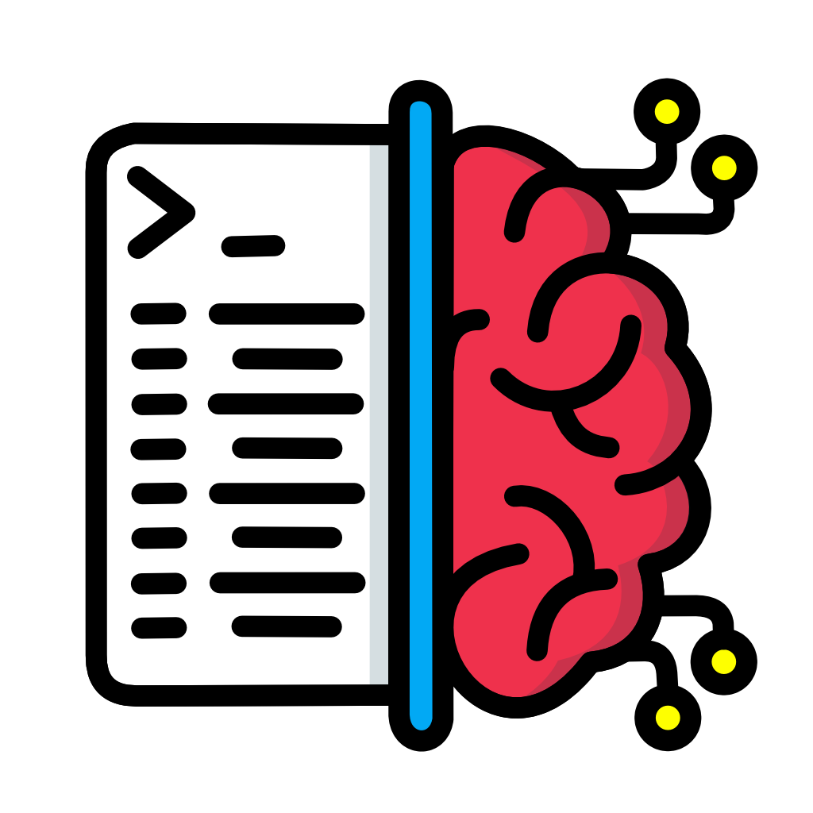

# Open Bot Brain Project 

## What is it?

The [Open Brain Bot (OBB)](https://www.openbotbrain.org) project is an
effort to implement a robot controller that is compatible with Lego
Mindstorm motors and sensors. OBB aims to design and publish
completely open hardware and open firmware to support the use of OBB
in educational and research settings.

## Why are we doing this?

The motivation started from the need to replace Lego Mindstorm EV3s
after the product was discontinued. Currently, we use them for a
module that makes first year university students practice their
programming skills. This serves as an introduction to robotics and,
most importantly, as an excuse for programming in "realistic"
environments that are messy and challenging to control. The idea is
that building and programming dependable robots is conceptually
related making robust programs in difficult environments.

When thinking about replacing the Mindstorm controllers, we want to
preserve two important features:

1. the students get to build an design their robots. The idea is that
   even if starting from a known design, it is important to have the
   ability to change it to make it easier to program, or more
   dependable. In a very real sense, the task is only to write a
   dependable robot, the design must follow that objective.

2. the replacement should support a variety of programming
   environments. After all, the primary use is to make students
   practice programming during their second term in school. So the
   objective is not having the shortest time to robot or the cheapest
   most efficient robot. The main objective is to practice programming
   in a robotic environment. For example, the mindstorms are
   programmed in Java using the [LeJOS](https://lejos.sourceforge.io/)
   because Java is what the students learned in the first term. But
   flexibility on this is also welcome because the board can be used
   for practicing other languages (we want to support
   [MicroPython](https://micropython.org/) first class also).

It is not obvious from these requirements that the only (or even the
best) solution is to design and build our own platform. In fact, if
this were the only use, it would not make sense to develop this. The
idea of the OBB is to build a community with many projects around it.
The current status is that the board design for the first version is
done, and students are working over the summer to develop firmware for
this system. In a very concrete sense project is already delivering
learning opportunities for students. Not yet about robotics but about
embedded programming. Also the OBB is serving as a research platform
for a project applying behavioural types to the challenge of
supporting more than one way to program the future robots (there will
be more projects soon).

So in a nutshell, the reason for this project is to have a versatile
and open platform to develop educational and research projects.

## How are we doing this?

The OBB is a board that uses microcontroller[^1] to interface 4 ports
with motor controllers together with 4 ports to connect Mindstorm
motors and sensors. Additionally, the board has a [Raspberry Pi style
40-pin
connector](https://www.raspberrypi.com/documentation/computers/raspberry-pi.html#gpio-and-the-40-pin-header)
to communicate with a [Raspberry Pi Zero 2
W](https://www.raspberrypi.com/products/raspberry-pi-zero-2-w/) (or
similar). While the Raspberry Pi is not a hard requirement (e.g.: the
OBB could run a robot implemented in MicroPython directly on the
microcontroller, the platform becomes much more powerful and versatile
when the Raspberry Pi Zero 2 W is connected. Concretely, a Raspberry
Pi is required to support the LeJOS (or a LeJOS-like) environment,
which is one of the motivating requirements for the project. However,
as mentioned before the project is designed with versatility in mind
in order to be suitable for different projects.

## Who is doing this?

...

## Can I participate?

...

[^1]: OBB uses an MCU by [ST](http://www.st.com), concretely the
[STM32L496ZG](https://www.st.com/en/microcontrollers-microprocessors/stm32l496zg.html)
that was chosen because it has enough peripherals (GPIO, PWM, Timers,
etc) to support all the Mindstorm devices and it was available when we
designed the board during the post-pandemic semiconductor shortage.
